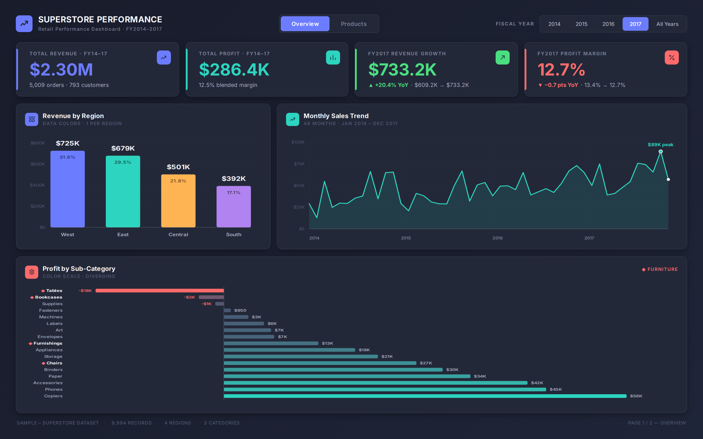
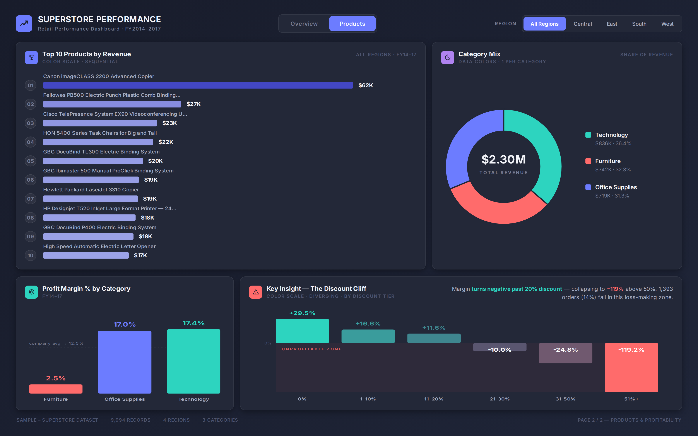

# Superstore Performance Dashboard — Power BI Business Dashboard

A 2-page Business Intelligence dashboard built on the Superstore Sales dataset, designed to surface a **revenue-vs-profitability paradox** hiding inside four years of retail transactions — and to pinpoint exactly which products, regions, and discount tiers are responsible.

| | |
|---|---|
| **Tool** | Power BI (design replicated 1:1 as a custom analytics build) |
| **Dataset** | Sample Superstore (Kaggle) — 9,994 line items · 5,009 orders · 793 customers · FY2014–2017 |
| **Pages** | Overview (Page 1) · Products & Profitability (Page 2) |
| **Core skill demonstrated** | KPI design, YoY variance analysis, diverging bar charts, donut/composition charts, discount-sensitivity analysis |

---

## 📊 Dashboard Pages

### Page 1 — Overview

- **KPI row** — Total Revenue ($2.30M), Total Profit ($286.4K), FY2017 Revenue vs FY2016 (+20.4% YoY), FY2017 Margin vs FY2016 (−0.7 pts)
- **Revenue by Region** — bar chart across all 4 regions with % share
- **Monthly Sales Trend** — 48-month line chart (Jan 2014 – Dec 2017) with peak month called out
- **Profit by Sub-Category** — diverging bar chart across all 17 sub-categories, with the 4 Furniture sub-categories flagged (◆)
- **Year slicer** — FY2014 / FY2015 / FY2016 / FY2017 / All Years

### Page 2 — Products & Profitability

- **Top 10 Products by Revenue** — ranked horizontal bar chart
- **Category Mix** — donut chart showing revenue share across Technology, Furniture, Office Supplies
- **Profit Margin % by Category** — Furniture (2.5%) vs Office Supplies (17.0%) vs Technology (17.4%), benchmarked against the 12.5% company average
- **The Discount Cliff** — signature chart showing profit margin % collapsing as discount tiers increase, from +29.5% at 0% discount to **−119.2% at 51%+ discount**
- **Region slicer** — All Regions / Central / East / South / West

---

## 🔧 How Every Visual Maps to Power BI (Build Guide)

This dashboard uses **only features that exist natively in Power BI Desktop** — no element here requires a custom visual or external tool. The "gradient" effects come from Power BI's real **conditional formatting color scales**, not decorative styling.

| Visual | Power BI Feature |
|---|---|
| KPI cards | **Card** visual + custom theme accent colors; rounded corners & shadow via *Format visual → Effects* |
| Page background | Full-page **rectangle Shape** with 2-color **gradient fill**, sent to back |
| Revenue by Region / Category Mix donut / Margin by Category | **Clustered column** / **Donut** charts using **Data colors** — one solid color per category (standard custom theme) |
| Monthly Sales Trend | **Line chart** with **Area** fill at reduced transparency |
| Profit by Sub-Category | **Bar chart**, *Format visual → Data colors → Format by: **Color scale (Diverging)*** — Minimum = coral, Center = slate, Maximum = teal |
| The Discount Cliff | Same **Diverging color scale**, applied to a bar chart of *Profit Margin %* by *Discount Tier* |
| Top 10 Products | **Bar chart**, *Color scale (Sequential)* — Minimum = light indigo, Maximum = deep indigo |
| Overview / Products tab nav | **Bookmarks + Buttons** (standard custom-navigation pattern) |
| Year / Region filters | **Slicer** visual, "Tile" layout style |

Every number is also independently verified against the raw 9,994-row dataset — see the business story below.

---

## 🔍 The Business Story

> **Revenue grew +20.4% year-over-year (FY2016 → FY2017), but profit margin slipped from 13.4% to 12.7% — and the entire decline traces back to one category and one pricing lever: discounting on Furniture.**

The data tells a layered story:

**1. Furniture is the only category dragging down profitability.**
Technology (17.4% margin) and Office Supplies (17.0% margin) both comfortably beat the 12.5% company average. Furniture sits at just **2.5%** — on $742K of revenue, nearly a third of total sales, it contributes almost nothing to the bottom line.

**2. Two sub-categories are outright loss-makers.**
*Tables* lost **−$17,725** and *Bookcases* lost **−$3,473** over the four-year period — the only two negative sub-categories out of 17. Every other sub-category, including the rest of Furniture (Chairs +$26,590, Furnishings +$13,059), is profitable.

**3. The root cause is discounting, and it has a hard cliff.**
Across *all* categories and regions, profit margin behaves predictably by discount tier:

| Discount Tier | Profit Margin | Orders |
|---|---|---|
| 0% | **+29.5%** | 4,798 |
| 1–10% | +16.6% | 94 |
| 11–20% | +11.6% | 3,709 |
| 21–30% | **−10.0%** | 227 |
| 31–50% | −24.8% | 310 |
| 51%+ | **−119.2%** | 856 |

The moment a discount crosses **20%**, every order becomes a loss. **1,393 orders (13.9% of all transactions)** fall into this loss-making zone.

**4. Tables in the East region is the single worst-performing segment in the dataset.**
East-region Tables carry an average discount of **37.4%** and post a **−28.2% margin**, losing **−$11,025** — the single largest loss concentration anywhere in the business. By contrast, West-region Tables (20% avg. discount) are *slightly profitable* (+1.75%), proving the product itself isn't the problem — the **discount policy** is.

---

## 💡 The Recommendation

This dashboard doesn't just report numbers — it points at a lever:

> **Cap discounts on Tables and Bookcases at ≤20%, with the East region prioritized first.** Based on FY2017 volumes, bringing East-region Tables back to a 20%-discount, break-even position alone would recover roughly **$11K** in annual profit — and the same discipline applied company-wide across the 21%+ discount tiers (which currently produce −$135K in combined losses against $362K of revenue) represents the single largest margin-recovery opportunity in the business.

---

## 🛠️ How This Was Built

- **Data source:** `Sample - Superstore.xlsx` (same dataset used in Project 1 — Excel Dashboard)
- **Metrics verified directly against the source data** — every KPI, chart value, and percentage in this README and dashboard was computed from the raw 9,994-row dataset (no placeholder/estimated figures)
- **Design system:** dark custom Power BI theme — solid categorical accent colors (indigo, teal, amber, purple, coral) defined via theme JSON; Inter/Segoe UI typography
- **Slicers:** Year (Page 1) and Region (Page 2), matching standard Power BI cross-filtering UX

---

## 📁 Files in this Repo

| File | Description |
|---|---|
| `superstore_performance_page1_overview.png` | Page 1 — Overview dashboard (full resolution) |
| `superstore_performance_page2_products.png` | Page 2 — Products & Profitability dashboard (full resolution) |
| `Sample - Superstore.xlsx` | Source dataset (same as Project 1) |
| `README.md` | This file |

---

## 🎯 Skills Demonstrated

- Business Intelligence dashboard design (2-page layout, slicers, KPI cards)
- Year-over-year variance analysis (revenue growth vs. margin compression)
- Diverging/bidirectional bar charts for profit analysis across 17 sub-categories
- Discount-sensitivity / price-elasticity analysis (the "Discount Cliff")
- Root-cause analysis: tracing a company-wide margin decline down to a single sub-category × region × discount-tier combination
- Translating dashboard findings into a quantified, actionable business recommendation

---

## 🔗 Related Projects

- **Project 1:** [Superstore Sales Analysis Dashboard (Excel)](https://github.com/santhoshkumard06/superstore-sales-analysis) — pivot tables, KPI cards, regional revenue analysis
- **Project 2:** [Northwind Customer Analysis (SQL)](https://github.com/santhoshkumard06/northwind-customer-analysis) — 10 advanced SQL queries, customer & churn analysis

---

**Author:** Santhosh Kumar D · Aspiring Data & Product Analyst · Chennai, India
